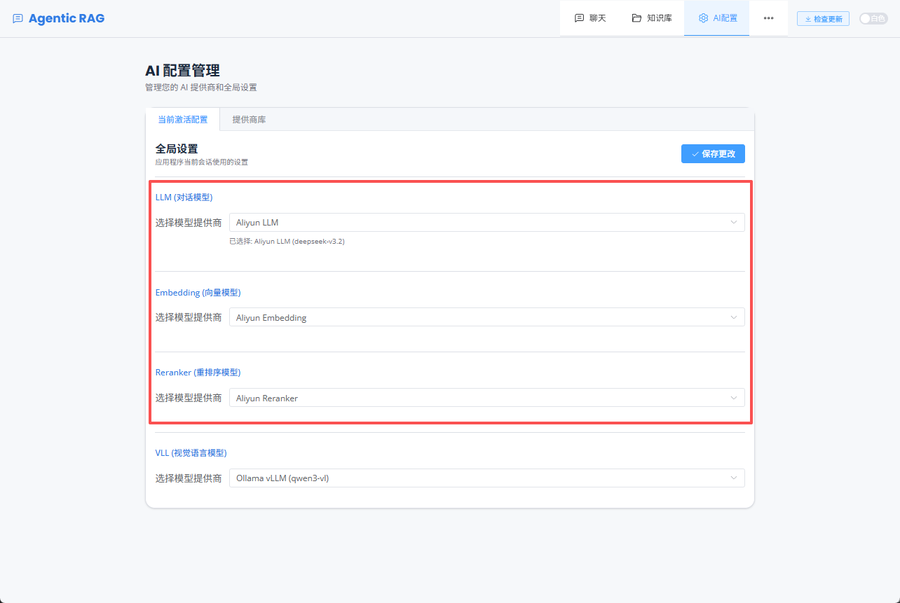
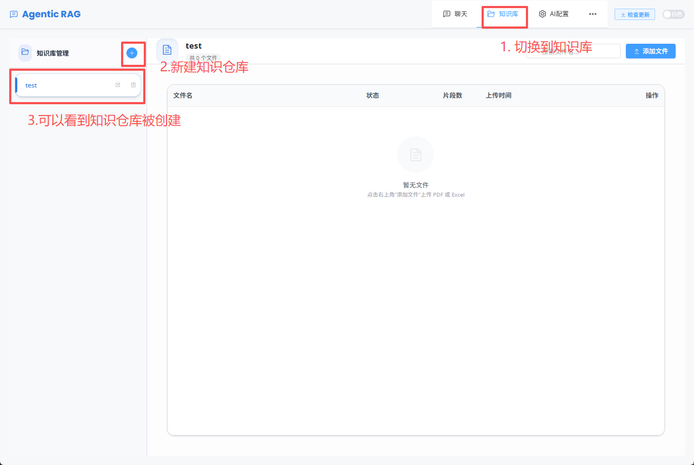
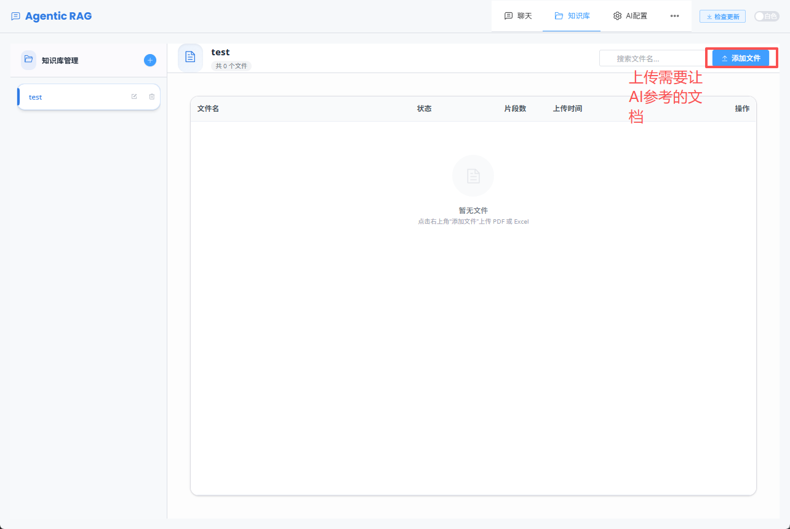
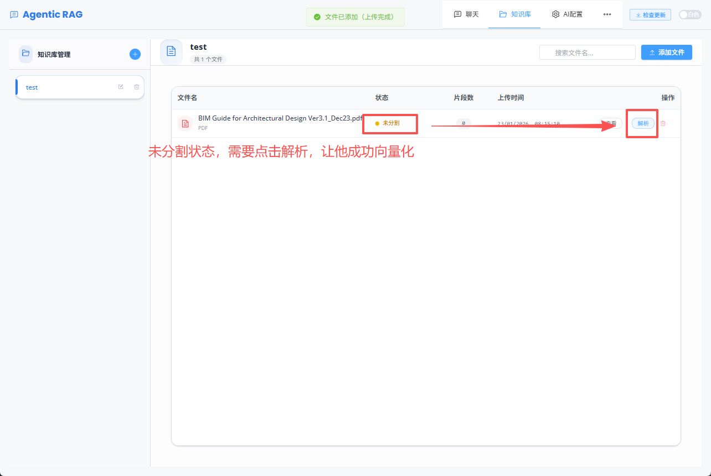
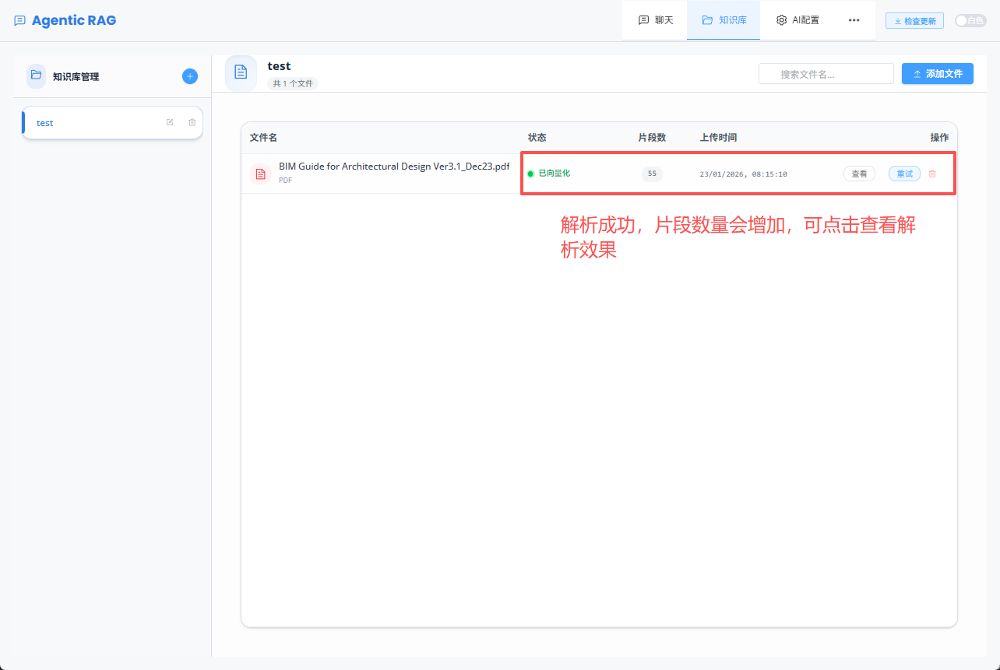
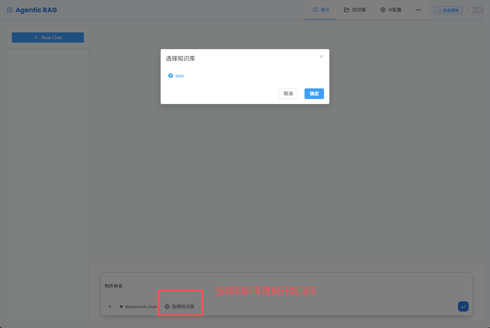
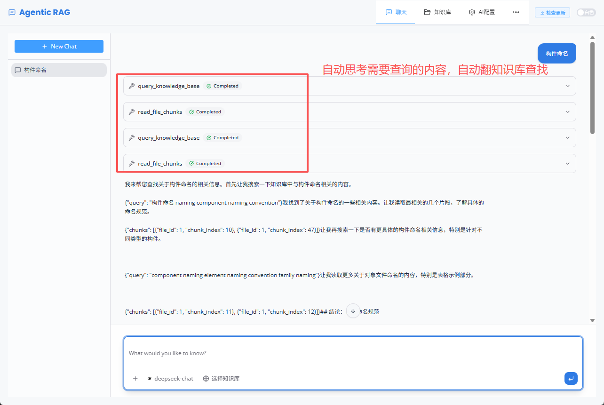
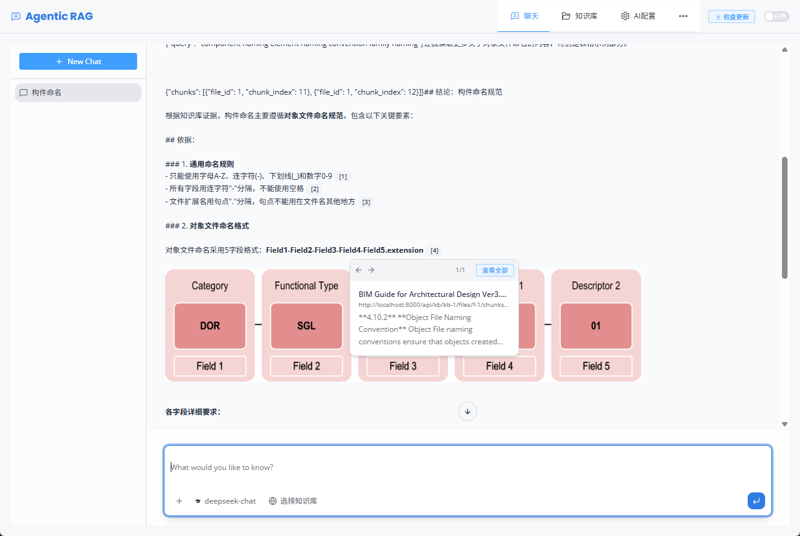

# 操作指引（含截图）

本文档基于目录 `assets/mannels` 下的截图编写，用于快速完成“创建知识库 → 上传资料 → 分析入库 → 开始提问 → 查看带引用的答案”的完整流程。

## 1. 确认网络通畅与模型设置

在开始前，先确认网络连接正常，并在应用内完成模型相关配置（如模型服务地址、可用模型等）。

## 2. 创建知识库（Knowledge Repository）

进入知识库/知识仓库管理页面，创建一个新的知识库，并填写必要信息（名称、描述等）。

## 3. 上传参考文件（References）

在新建的知识库中，上传需要作为知识来源的文件（如 PDF、Word、Markdown、图片等），作为后续分析与检索的资料。

## 4. 开始分析/入库

上传完成后，触发“分析/处理/入库”等操作，让系统对文件进行解析、切分、向量化等处理。

## 5. 等待分析完成

观察任务状态，直到显示分析完成或进度结束，确保资料已成功入库，可用于后续问答检索。

## 6. 开始向智能体提问

进入对话/问答界面，选择刚刚创建并完成分析的知识库，然后输入问题开始提问。

## 7. 自动思考与查询

提问后，系统会进行自动思考与检索查询（例如生成检索式、召回片段、重排等），等待流程执行完成。

## 8. 查看带图片与引用的答案

最终答案会展示文本内容，并可能附带图片与引用来源（citation/引用卡片/原文片段），便于追溯依据。

