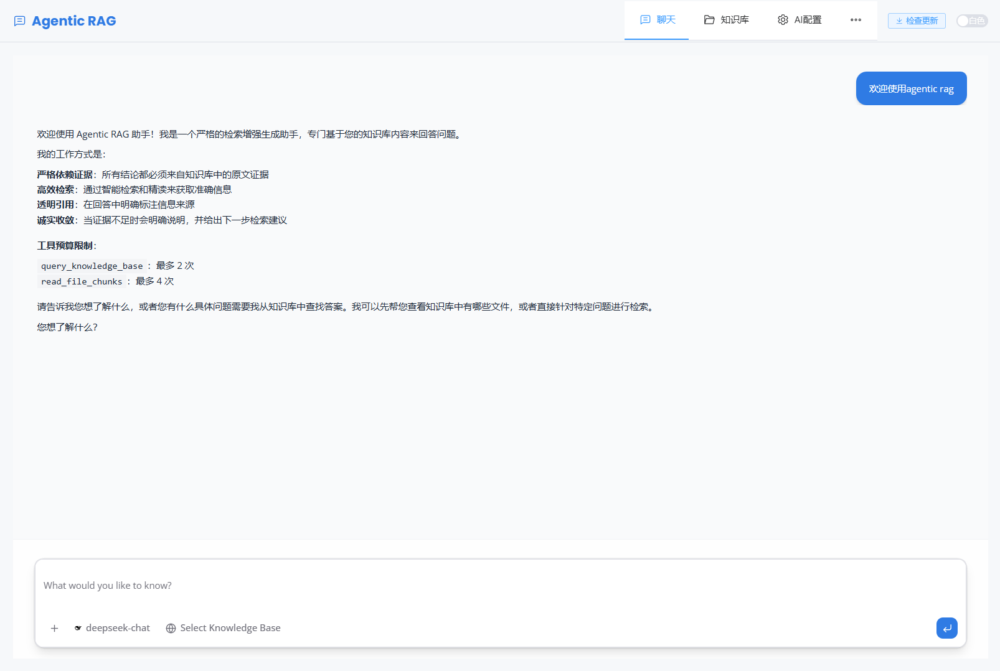
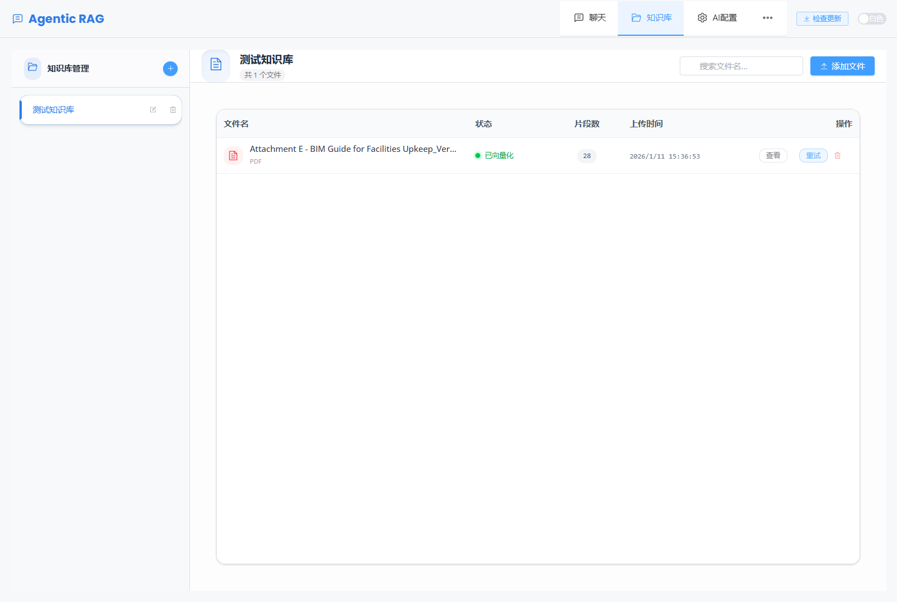
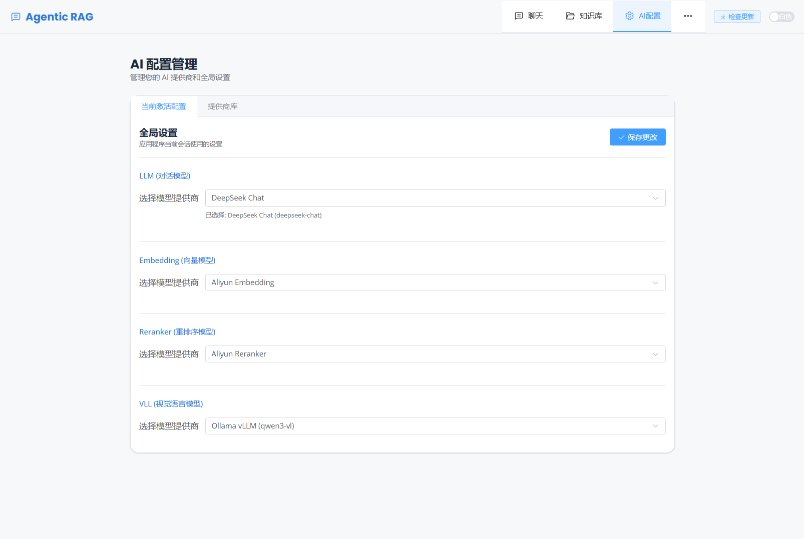

# Agentic RAG

[](README.md)

Agentic RAG 是一个全功能的检索增强生成 (RAG) 应用程序，结合了强大的 Python 后端和现代化的 Vue.js 前端。它集成了智能 Agent、知识库系统和文档处理能力，并提供了一个用户友好的操作界面。

本项目专为 **本地部署** 设计，通过本地向量库和本地数据库确保您的数据隐私安全。

## 📸 产品展示

<div align="center">
  
  <p><em>支持 RAG 的智能聊天界面</em></p>
</div>

<div align="center">
  
  <p><em>知识库文档管理</em></p>
</div>

<div align="center">
  
  <p><em>灵活的 AI 模型配置</em></p>
</div>

## ✨ 核心特性

- **🔒 本地优先与隐私安全**：专为隐私构建。完全本地运行，使用 **本地向量库 (ChromaDB)** 和 **本地数据库 (SQLite)**。您的数据完全掌握在自己手中。
- **🤖 智能 Agents**：利用 LangChain 和 LangGraph 处理复杂的推理和检索任务。
- **📚 知识库系统**：上传并管理文档（PDF, Word 等），为 AI 提供上下文支持。
- **🔌 多模型支持**：无缝集成 OpenAI, DeepSeek, Ollama, DashScope (通义千问) 等多种模型。
- **📄 文档处理**：具备高级文档处理能力，包括 PDF 解析和 Word 文档重写。
- **🖥️ 混合应用界面**：既可作为 Web 应用运行，也可作为 Windows 桌面应用 (WPF) 运行。
- **💬 聊天交互**：支持流式响应和生成式 UI (Artifacts) 的实时聊天。

## 🛠️ 技术栈

- **后端**: Python, FastAPI, SQLite, SQLAlchemy, LangChain, ChromaDB
- **前端**: Vue 3, TypeScript, Vite, Tailwind CSS, Shadcn UI
- **桌面端**: WPF (Windows Presentation Foundation) 封装容器

## 🚀 快速开始

### 前置要求

- **Python** 3.11+
- **Node.js** (用于前端)
- **Git**

### 1. 后端设置

1.  克隆仓库：
    ```bash
    git clone https://github.com/yourusername/agentic_rag.git
    cd agentic_rag
    ```

2.  安装 Python 依赖：
    ```bash
    pip install -r requirements.txt
    # 或者如果使用 pyproject.toml
    pip install .
    ```

3.  配置环境变量：
    复制 `.env.example` 为 `.env` 并填入您的 API Key。
    ```bash
    cp .env.example .env
    ```

4.  运行服务：
    ```bash
    python -m backend.entrypoints.server
    ```
    API 服务将在 `http://localhost:8000` 启动。

### 2. 前端设置

1.  进入前端目录：
    ```bash
    cd frontend/agui-vue
    ```

2.  安装依赖：
    ```bash
    npm install
    ```

3.  启动开发服务器：
    ```bash
    npm run dev
    ```
    UI 界面将在 `http://localhost:5173` 启动。

## 📦 Windows 版本构建

如需构建独立的 Windows 桌面应用程序（安装包）：

1.  确保已安装 **Python**, **Node.js**, **.NET SDK**, 和 **Inno Setup 6**。
2.  运行自动化构建脚本：
    ```cmd
    setup\auto_setup.bat
    ```
3.  脚本将自动执行以下步骤：
    - 构建 Vue 前端资源。
    - 将 Python 后端编译为可执行文件。
    - 构建 WPF 桌面容器。
    - 在 `Output` 目录生成安装包。

## ⚙️ 配置说明 (.env)

| 变量名 | 说明 | 示例 |
| :--- | :--- | :--- |
| `APP_ENV` | 运行环境 (development/production) | `development` |
| `LLM_BASE_URL` | LLM 提供商的基础 URL | `https://api.openai.com/v1` |
| `LLM_API_KEY` | LLM API 密钥 | `sk-...` |
| `LLM_MODEL` | 默认 LLM 模型名称 | `gpt-4o` |
| `EMBEDDING_BACKEND` | Embedding 后端提供商 | `ollama` 或 `dashscope` |
| `EMBEDDING_BASE_URL`| Embedding 基础 URL | `http://localhost:11434` |
| `LOG_LEVEL` | 日志级别 | `INFO` |

## 📅 开发计划

- [ ] **高级分块模式**：支持更多文档切分策略（如语义分块、层级分块等）。
- [ ] **聊天历史记录**：支持聊天会话的持久化保存与管理，方便回顾历史对话。

## 📄 许可证

[MIT](LICENSE)
